# Fizmath Plaza

This is an architectural proposal. Tremendously simplified event-driven modular-monolith ( microservice ready ) e-commerce platform with order processing microservice.  Created with the fantastic trio: Go, Nats JetStream  and  Vue.js  with rich CRUD operations and fun and luxury PrimeVue UI  with it's integrated Tailwind CSS features. 

Built in accordance with Hexagonal Architecture principles, this platform incorporates CQRS, gRPC-Gateway and  VUE.js compiled files  embedded via ECHO middleware, ... ensuring scalability, maintainability and high performance.

## The Full Stack

- Frontend 
  - [Vue 3.4](https://vuejs.org/)
  - [PrimeVue 4.0 ](https://primevue.org/)
  - [Pinia 2.2](https://pinia.vuejs.org/)
  - [Vue Router 4.4](https://router.vuejs.org/)
  - [Axios 1.7](https://axios-http.com/)

- Backend
  - Go 1.23
  - [NATS JetStream V2.10](https://docs.nats.io/)
  - PostgreSQL
  - [gRPC-Gateway](https://github.com/grpc-ecosystem/grpc-gateway)
  - [Echo 4.12](https://echo.labstack.com/)


## 

Let the gRPC minds it's own API business, the asynchronous event-driven communications exclusively  implemented through NATS JetStream

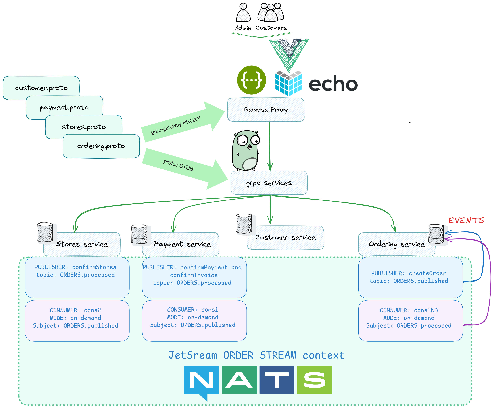

The new  on-demand Pull Consumers in JetStream  substantially  simplifies any event-driven mechanism :  "Since each subscription is fetching messages on-demand, multiple subscriptions can be create bound to the same pull consumer without any additional configuration. Each subscriber can fetch batches of messages and process them concurrently."


## Install the project locally  

This is a dev installation mode so that you can easily  modify  the code and the architecture both in frontend and backend stacks. Also i did not include any make or bash file, nor did i bound any package to this repo.


-  ## Backend 

First verify  that GO is installed in your PC : 

```bash
$ go version
go version go1.23.3 linux/amd64
```
before installing the `go.mod` file you need to install these  `gRPC-Gateway` packages, in the same directory as `go.mod`, RUN:

```bash
/Fizmath-Plaza-main$ go get \
    github.com/grpc-ecosystem/grpc-gateway/v2/protoc-gen-grpc-gateway \
    github.com/grpc-ecosystem/grpc-gateway/v2/protoc-gen-openapiv2 \
    google.golang.org/protobuf/cmd/protoc-gen-go \
    google.golang.org/grpc/cmd/protoc-gen-go-grpc
```

wondering why not `go install` ?  since `go.mod` is there !

for added assurance, run these commands as well, 

```bash
/Fizmath-Plaza-main$ export PATH="$PATH:$(go env GOPATH)/bin"

/Fizmath-Plaza-main$ PATH="${PATH}:${HOME}/go/bin" 
```

then RUN : 

```bash
/Fizmath-Plaza-main$ go mod tidy 
``` 

the project requires that the NATS server and the PostgreSQL database are both up and running. Nothing is more cleaner than  docker-compose to pull the images and to configure envs and volumes locally :

```bash
/Fizmath-Plaza-main$ docker compose up -d
``` 

see the docker compose logs to make sure that the database migrated  and ready to accept connections also you'll see the  satisfying JETSTREAM logo :

```bash
/Fizmath-Plaza-main$ docker compose logs -f
``` 

in the `/cmd`  directory RUN : 

```bash
/Fizmath-Plaza-main/cmd$ go run . 
``` 

checkout the Swagger endpoint :

 Service | URI
 --- | ---
 Swagger | [http://localhost:8080/](http://localhost:8080/)

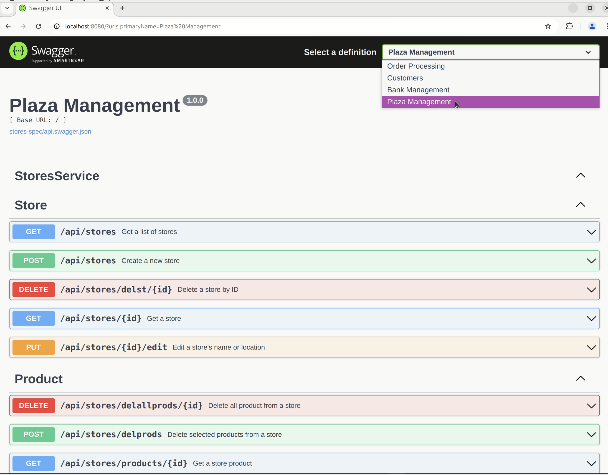

once you see the above endpoint up and running it means that the backend service is ready.
For now do not mess with the Swagger, we have a nice frontend UI ...

- ## Embedded frontend with ECHO middleware using reverse proxy

while yet the docker compose and the above backend are both running, open a new Terminal in this directory `ECHO/` and RUN :

```bash
/Fizmath-Plaza-main/ECHO$ go run .
```
this launches the ECHO server  :  [main.go](ECHO/main.go)

The embedded `dist` folder was generated by the command `npm run build` from the `ECHO/VUE` directory. It contains compactly compiled files of our VUE source code, suitable for production.

OPEN :

 Service | URI
 --- | ---
 ECHO reverse-proxy | [http://localhost:4173/](http://localhost:4173/)


Then follow the slides below . 


- ## Frontend development server

For any modifications to the project,  the frontend VUE source code  is available in the `ECHO/VUE` directory

first make sure that Node.js and npm are installed in your laptop : 

```bash
$ node -v
v18.19.1

$ npm -v
9.2.0
```
for the  development you don't need the `ECHO` server, so shut it down by `CTRL+C`.  

While still  docker compose and the backend in `cmd`  are both up and running, in the `/ECHO/VUE` directory RUN :

```bash
/Fizmath-Plaza-main/ECHO/VUE$ npm install
``` 

this installs all the freezed packages from  [package.json](ECHO/VUE/package.json) 

> [!WARNING]
> Javascript's dependencies are something out of  hell. Even packages that were frozen in place by `package.json`, which were installed without any issues just yesterday, are now causing dozens of error messages and 
deprecation warnings when simply re-installed today - with no apparent explanation or solution.


after the installation done, a new heavy folder `node_modules` generated in the same directory. RUN :

```bash
/Fizmath-Plaza-main$/ECHO/VUE$ npm run dev
``` 
open this endpoint :

 Service | URI
 --- | ---
 VUE UI | [http://localhost:5173/](http://localhost:5173/)

this is a development server which auto-updates the browser when you save changes. Now you can make changes to the VUE's source code . Note that this server requires that the  backend is up and running. For any pertinent backend changes you ought to re-compile the Go server in the `/cmd` directory.

Once your are happy with your new modifications, you can update the ` dist ` folder by  `npm run build` for  your `ECHO` production server.

There are yet two additional installation hints for your dev environment : 

- SWAGGER UI

I downloaded the swagger UI from [here](https://github.com/swagger-api/swagger-ui). In our project we only need the `dist` folder of the bundle. The contents of `dist` pasted into `internal/web/swagger-ui` . Follow  `*services*/internal/rest`  folders  to learn how to  configure your own swagger endpoints.

- BUF

If you modify  any of the   `.proto` files,  you ought to  re-compile buf files;  [buf.gen.yaml](ordering/buf.gen.yaml);  by running  `$ go generate` in the same directory. 
I installed  [BUF](https://github.com/bufbuild/buf) in Ubuntu by [Homebrew](https://brew.sh/)

```bash
$ buf --version
1.47.2 
``` 

## Screenshots and Discussion

from the sidebar menu click  the Plaza Admin page then enter your inventory name and location  by clicking the `+new` dialog :

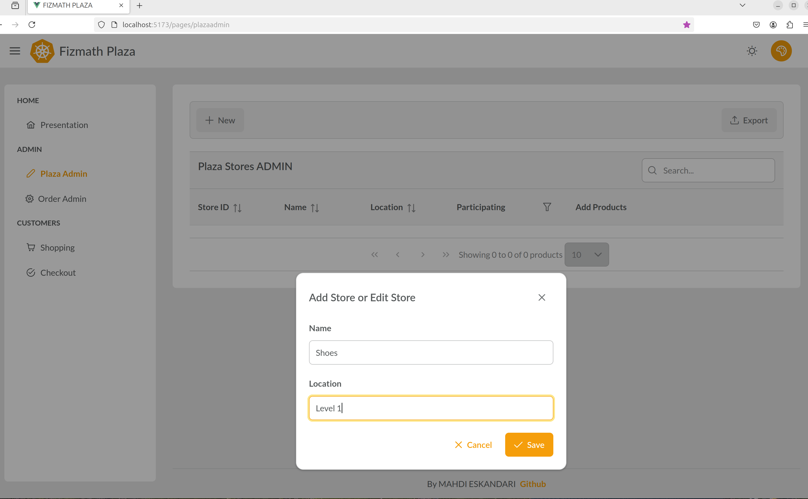

every single entity in the project has it's own global `uuid` unique identifier. 

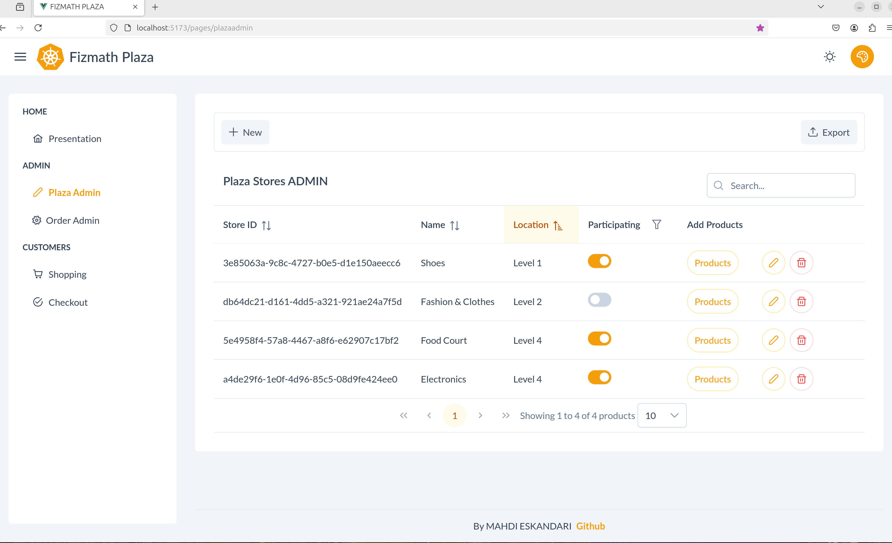

After creating some stores, by toggling  participation, select stores that you want to participate in shopping. But first populate your
stores with products by clicking the `Products` button which redirects to store's products page.

Click the `+new`  dialog  to add your products. The SKU stand for Stock Keeping Unit, we need this
to demo order's `OUT_OF_STOCK` event.

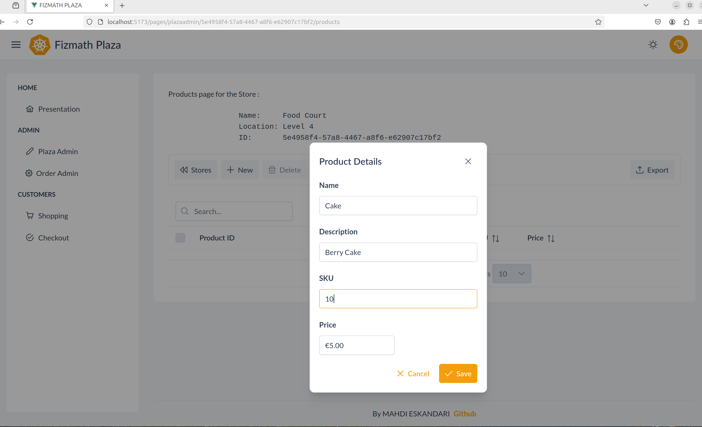 

Add more products to your stores :

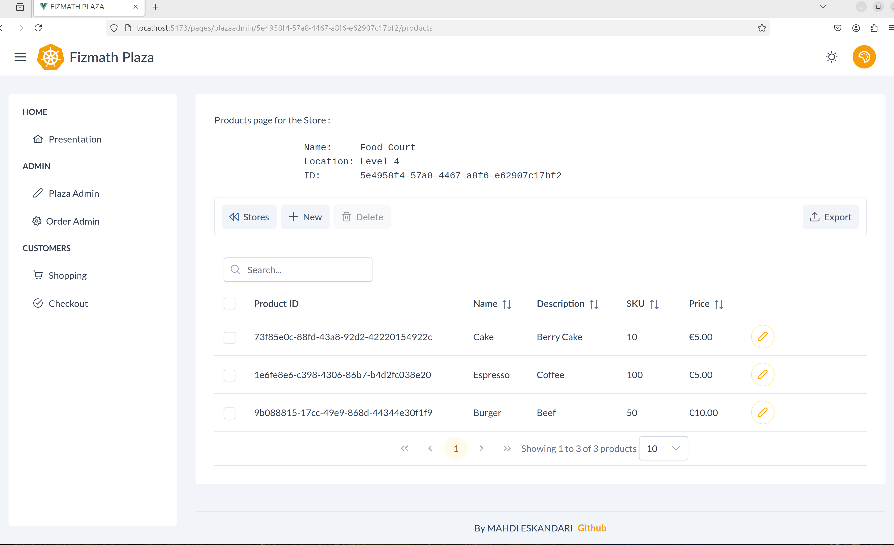


by clicking `Shopping` in the sidebar menu  you see products of your stores which you toggled to participate.
Now, as a customer add some products to your basket :

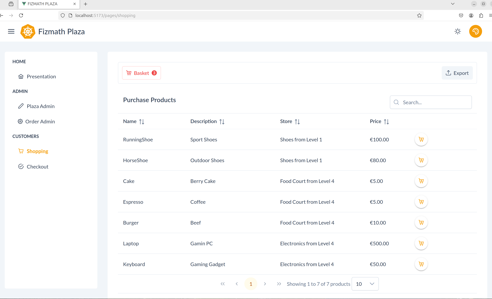

click the `Basket` button with a badge on it to review or delete your items then push `Checkout` in the menubar :

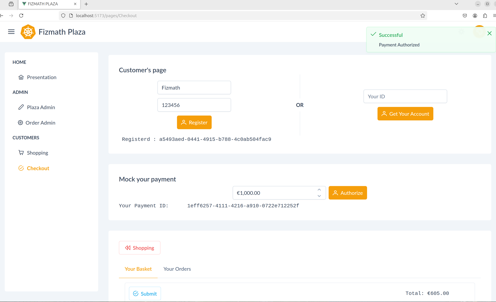

first enter any name and phone number then click to get your customer's ID, then just simply push the `Authorize` button to mock your payment.
After getting your `Payment ID`  the `submit` button will be enabled, now you can submit your purchase :


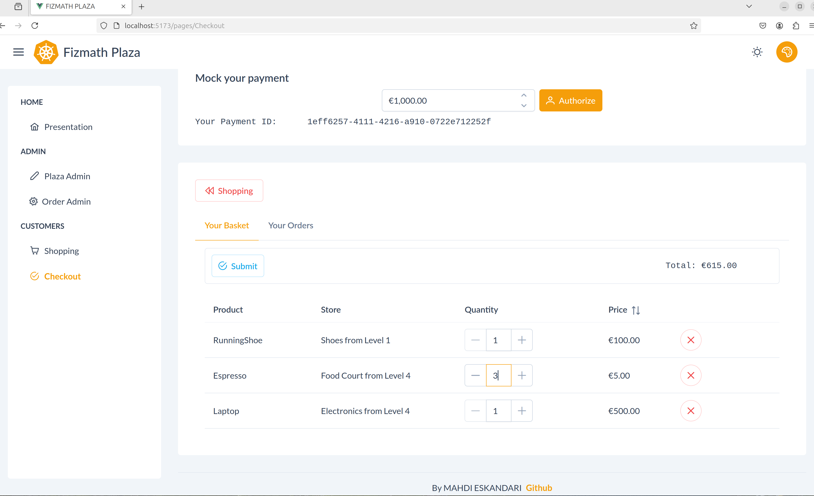

After pushing the submit button click the `Your Orders` tab then after a few seconds you see your initial order status `pending` :

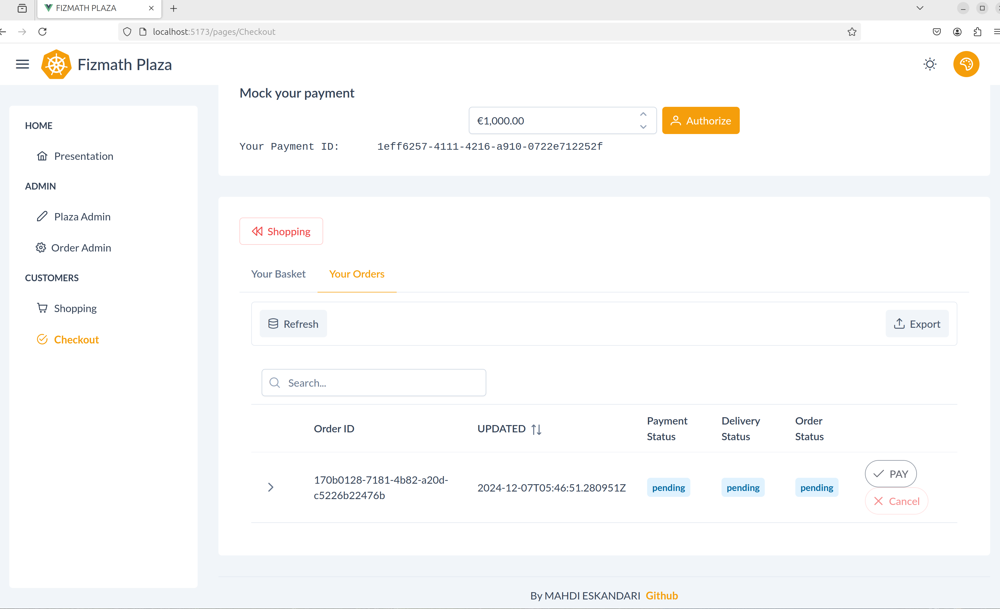


## ORDER status events

By submitting your order  you just launched JetStream  publishers and consumers messaging. Now things gonna to be interesting. While in the `Your Orders` tab,  wait  a few seconds then refresh your order status by clicking the `Refresh` button : 


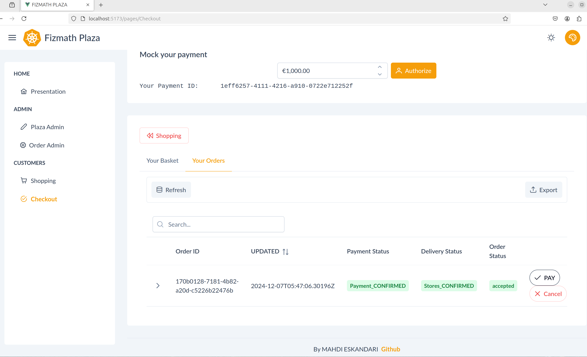

once your order ` accepted`  the `Pay` button get enabled, so either push it to get `deliverd` status or click `cancel`  for whatever reason.

 -  Payment confirmation  event

Within  `5 seconds` your payment status will be double checked and confirmed  [here](payments/internal/application/application.go) is the backend code.

Firstly, it double checks your payment ID, this is good for detecting frontend fraudulent activities. Since your authorized  payment amount was in the past time, you may have spent some money before submitting the current order.
in our demo this is always verified as true.

Secondly, if your order's total  amount is greater than your mocked authorized payment then your payment  get rejected. You can simply mock this rejection before submitting your order.

 - Stores Confirmation event

After `15 seconds` you get store confirmation event. [here](stores/internal/application/commands/confirm_event.go) is the backend code.


If your order's  product  quantity is greater than SKU then you get ` OUT_OF_STOCK` event. You can get this event  by deliberately entering the quantity greater than SKU. Note that this is just for demo: no frontend restrictions. 

There is a more realistic way to get this rejection event: after submitting your order, immediately copy your Customer's ID before leaving the Customer's page ( since there is no KEEP ALIVE ) then jump to the `Plaza Admin` page and  find the store and one of our submitted products, there  push the edit button and in the SKU field enter `0` then save the dialog box.
Back to the  the customer's page paste your id  then click ` get your account` then go to the ` Your Order` tab . if your have succeeded under `15` seconds refresh to see the ` OUT_OF_STOCK` event.

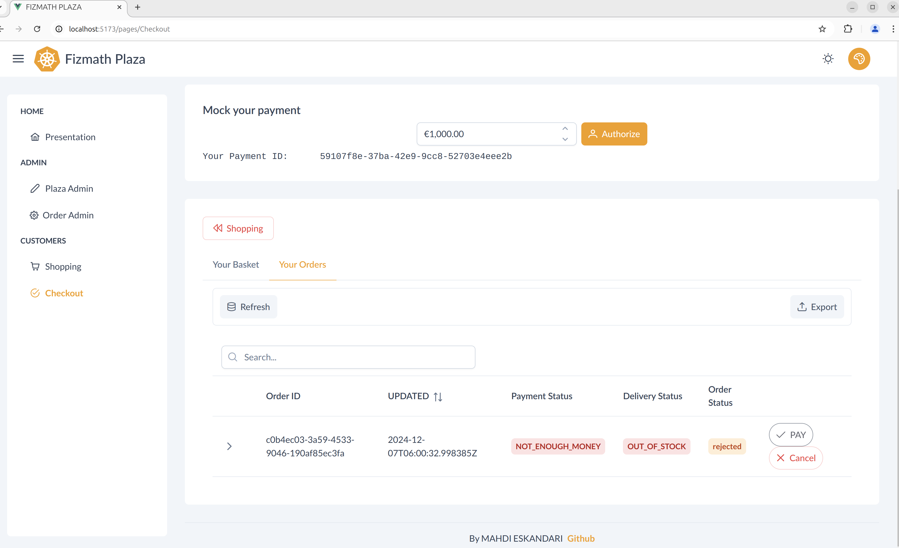

after creating some orders, let's got to the ` ORDER ADMIN` page in the menubar :


##  Event Sourcing 

Finally, we arrive at the central purpose of this project.


The `refresh`  buttons retrieves final status of all orders  recorded by timelapse from  the database

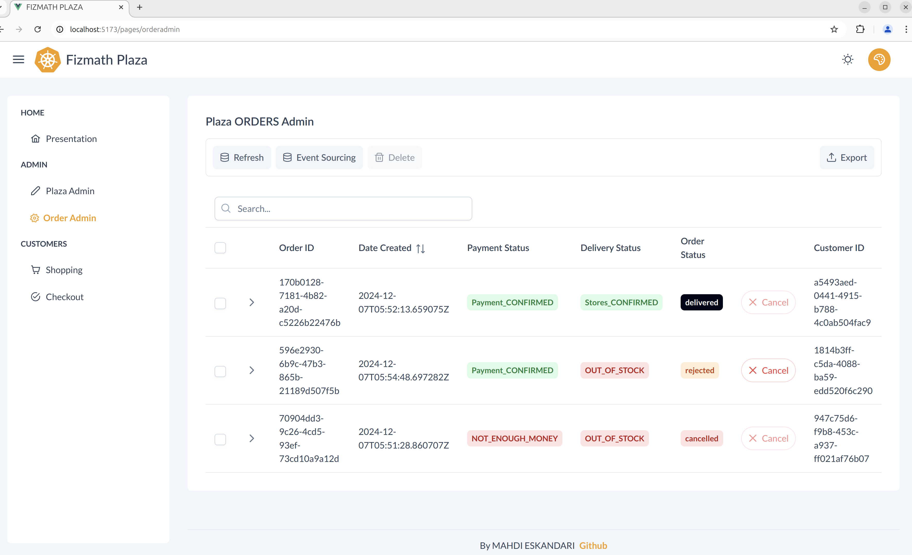

The order repository  has no `UPDATE` command. Every single row is an event sorted by timestamp. The [ordering database](PostgreSQL/3_create_ordering_schema.sh)  has a `SERIAL` auto-increment  pseudo-type as foreign key, unlike other databases where the foreign key set as `uuid`, therefore,  in conjunction with timestamptz and order's `uuid` identifier we have  impossible to duplicate and easy to manage `event versioning` mechanism. 

By clicking on the `Event Sourcing` button, you'll receive all events for all orders. To single out a specific order just copy an order ID and paste it into the search box you'll see timeline of all events of a specific order. Use ` date created`  to sort by ascending or descending time :

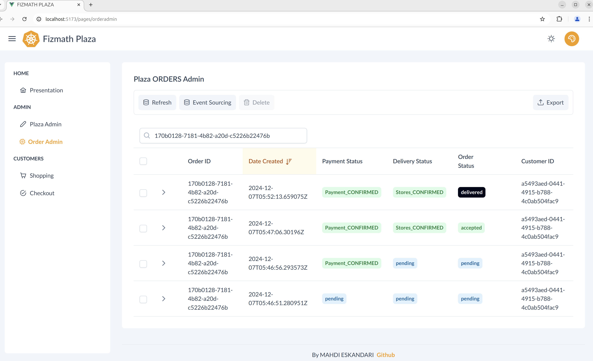


As an added perk, simply open your browser's developer tools and indulge in the error-free `console`. 

This concludes our API's functionalities walkthrough.

## Pinia and Vue Router 

Just like factoring out equations zyx(a+b+c) = xyza+zyxb+zxyc, Pinia allows you to 'factor out' some arrays and functions, so that independent Views or pages can share them as global variables. This  eliminates the need for a parent-child complex data transfer design. Here is our [Pinia stores](ECHO/VUE/src/stores/global.js) 

Besides VUE's features, those global `basket` and `sstores` arrays in our Pinia greatly eliminate backend complexities, just forget about the VUE frontend and try to 
follow the above slides by the Swagger then you will appreciate that nice frontend stack. 

Besides Vue Router's main functionalities, sometimes you need  to convey small routing data. see  this [slide](docs/a4.png) 
where Pinia in conjunction with Vue Router's [:dynamic](ECHO/VUE/src/router/index.js) conveys some info, if you refresh the page the store's id stays the same but  name and location got lost ,so fix it ! 


## Befitting  NATS JetStream into Hexagonal Architecture

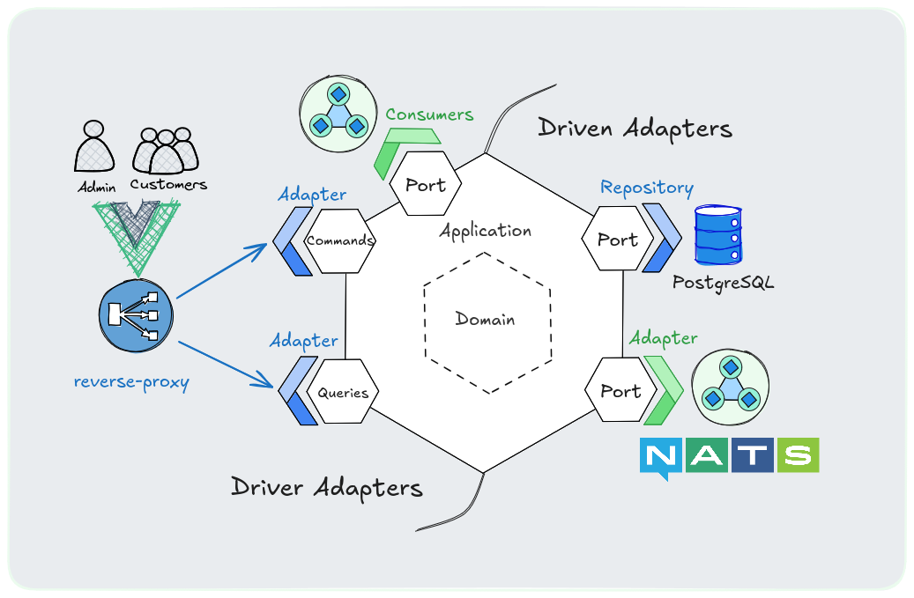

Interface checkers:

```Golang
var _ PubPort = (*IntegrationEventHandlers)(nil)
```
represent ports and adapters in a single page

for JetStream we have both publisher and consumer ports and adapters, consumed by domain and applications. 

Consumer adapters receive incoming messages  then "DRIVE" them into the application via ConfirmOrder Port this  is why i pinned them at the driver's side. 

Actually, The Hexagonal Architecture provides a clear and concise 'blueprint' for building modular, scalable, and  adaptable software systems.


Initiating your project with this Architecture or another approved CLEAN Architecture 
ensures that you are at least adhering to a widely accepted framework, despite any potential 
for **minor breaches**  to the architecture from your side, which is absolutely  natural.


## Disclaimer

In developing this architectural proposal, I may have made some errors or oversights. In some general instances,  I may have glossed over important considerations or overlooked potential pitfalls.  Hence,  feel free to challenge every single line of this project. 


You might remove CQRS in ordering and inventory services with impunity as in our payment service. This also gives you more _Pure_ domain. 


For order creation scenarios, orchestrating a SAGA may not be strictly necessary. Firstly,  that global `basket` array in our Pinia is an ephemeral frontend cache.
Secondly, what if a girlie just registered and confirmed the payment then changed  her mind and quitted the purchase not pushing the submit button?  since she may use her  ID after a month or so. For this case  you need to create a `Customers Admin`  page.
 
[Here](ordering/internal/application/commands/create_order.go) is a simple ACID like SAGA where, first the order saved in the database then if any  error happens in publishing the message, the data removed from the database as if nothing happened.

That `15 seconds` stores confirmation event is more general than in a real-wold application : wouldn't it better to separate any single store as individual service with its own delivery confirmations time ? 

In the  [Checkout page](ECHO/VUE/src/views/pages/Checkout.vue), the `getOrders()` method fires every time you load the page, it gets all orders from the backend then it filters out a Customer's orders. That is superfluous. **Exercise :** can you code to get orders just by Customer's ID from the backend ? 


This demo may be small-scale, but the list of TODO or not TODO stretches on forever, suggesting that there's still a great deal of work to be done before this project reaches its 
full potential...

When it's go-live time for a mission-critical application in the cloud, with real users and revenue on the line, deployed  on Kubernetes clusters, with all the heck of load balancing and monitoring and tracing dogs dealing with millions of concurrent connections;  according to performance, scalability and maintainability issues you will have to modify and adapt the architecture to your business goals and business logic. Yet in this case you should design  enterprise-grade tests from the base of the pyramid mock up to the end to end testing. 

Anyway, I hope that this foundational demo contribution will be found helpful in understanding the key concepts.


#  Additional  resources
##  General

- https://github.com/PacktPublishing/Event-Driven-Architecture-in-Golang
- https://microservices.io/
- https://www.oreilly.com/library/view/designing-event-driven-systems/9781492038252/
- https://www.oreilly.com/library/view/building-microservices-2nd/9781492034018/
- https://natsbyexample.com/
- https://github.com/nats-io/nats.go/tree/main/jetstream
- https://github.com/Sairyss/domain-driven-hexagon
- https://github.com/GoogleCloudPlatform/microservices-demo
- https://github.com/thangchung/go-coffeeshop


##  VUE
- https://vueschool.io/
- https://www.packtpub.com/en-us/product/vuejs-3-design-patterns-and-best-practices-9781803249001
- https://github.com/primefaces/sakai-vue


